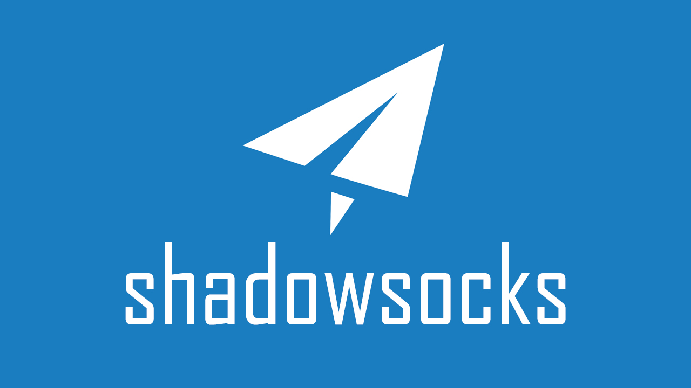
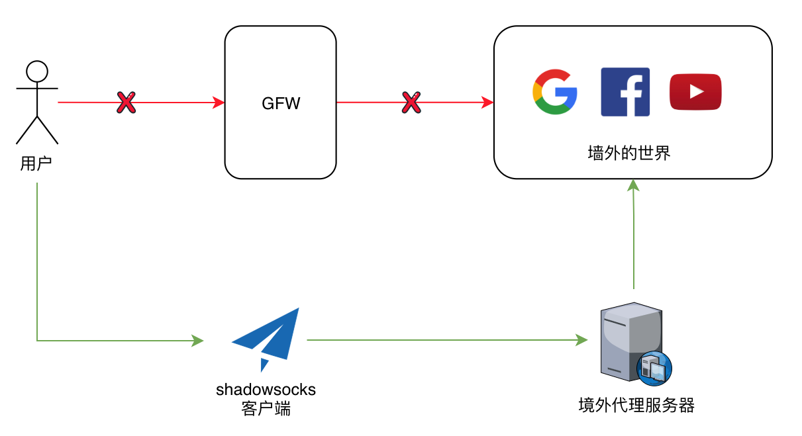
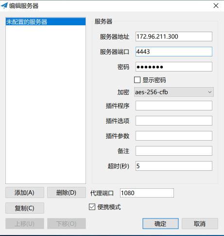
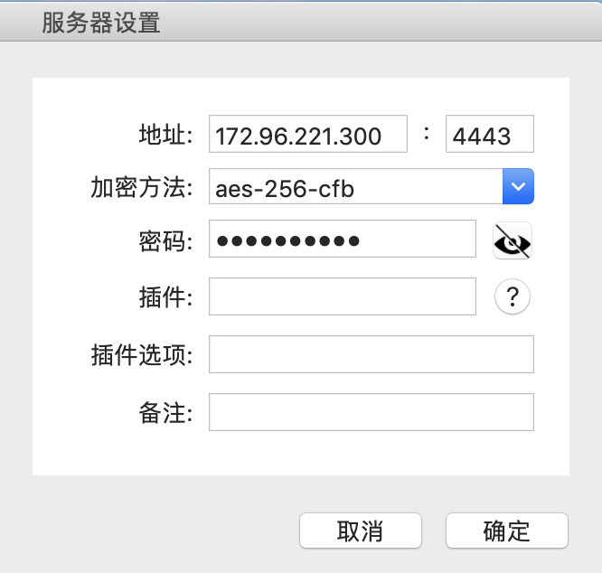

<!-- TOC -->

- [手把手教你，搭建搬瓦工 SS 代理](#手把手教你搭建搬瓦工-ss-代理)
    - [一、必须搞懂的几个名词](#一必须搞懂的几个名词)
        - [1. 什么是 VPS](#1-什么是-vps)
        - [2. 什么是 VPN](#2-什么是-vpn)
        - [3. 什么是 ss / ssr](#3-什么是-ss--ssr)
            - [ss](#ss)
            - [ssr](#ssr)
        - [4. vpn和ss/ssr的区别和优缺点](#4-vpn和ssssr的区别和优缺点)
        - [5. 什么是 GFW](#5-什么是-gfw)
    - [二、翻墙的原理](#二翻墙的原理)
    - [三、软硬件环境](#三软硬件环境)
        - [搬瓦工服务器](#搬瓦工服务器)
            - [常用链接](#常用链接)
            - [购买方式](#购买方式)
    - [Quick Start](#quick-start)
        - [1. 服务器配置](#1-服务器配置)
            - [前置环境](#前置环境)
            - [Python 与 pip 安装](#python-与-pip-安装)
            - [安装 Shadowsocks server](#安装-shadowsocks-server)
            - [配置 Shodowsocks server](#配置-shodowsocks-server)
        - [2. 客户端配置](#2-客户端配置)
            - [Windows](#windows)
            - [Mac OS X](#mac-os-x)
    - [推荐一些翻墙代理](#推荐一些翻墙代理)

<!-- /TOC -->

# 手把手教你，搭建搬瓦工 SS 代理

由于经常需要翻山越岭看看墙外的世界，用过很多浏览器插件、第三方代理，可是因为人数限制、稳定性和安全性，于是决定开始搭建一个属于自己的代理服务。

本文从零开始，手把手教你搭建自己的 shadowsocks 代理服务器实现科学上网。包括 VPS 购买，连接 VPS，一键搭建 shadowsocks，客户端配置shaodowsocks。





## 一、必须搞懂的几个名词

### 1. 什么是 VPS

**虚拟专用服务器**（英语：Virtual private server，缩写为 VPS），是将一台服务器分割成多个虚拟专享服务器的服务。


### 2. 什么是 VPN

VPN 在很多人心目中就是用来翻墙的工具，其实不是。VPN 最主要的功能，并不是用来翻墙，只是它可以达到翻墙的目的。

**虚拟专用网络**（英语：Virtual Private Network，缩写为VPN），它的功能是：在公用网络上建立专用网络，进行加密通讯。在企业网络和高校的网络中应用很广泛。你接入 VPN，其实就是接入了一个专有网络，你的网络访问都从这个出口出去，你和 VPN 之间的通信是否加密，取决于你连接 VPN 的方式或者协议。


### 3. 什么是 ss / ssr

#### ss

ss作者是 [GitHub：clowwindy](https://github.com/clowwindy)，大约两年前，他自己为了翻墙写了shadowsocks，简称 ss 或者叫影梭，后来他觉得这个东西非常好用，速度快，而且不会被封锁，他就把源码共享在了 GitHub 上，然后就火了，但是后来作者被请去喝茶，删了代码，并且保证不再参与维护更新。


#### ssr

在ss作者被喝茶之后，GitHub 上出现了一个叫 breakwa11(破娃)的帐号，声称 ss 容易被防火墙检测到，所以在混淆和协议方面做了改进，更加不容易被检测到，而且兼容 ss，改进后的项目叫 shadowsocks-R，简称 ssr，然后 ss 用户和 ssr 用户自然分成了两个派别，互相撕逼，后来，破娃被人肉出来，无奈之下删除了 ssr 的代码，并且解散了所有相关群组。


### 4. vpn和ss/ssr的区别和优缺点

通过上面的介绍，其实基本已经能看出 vpn 和 ss/ssr 的区别了，那么他们到底孰优孰劣。

因为 VPN 是走的专用通道，它是用来给企业传输加密数据用的，所以 VPN 的流量特征很明显，以 openvpn 为例，更详细的在这里不说了，流量特征明显，防火墙直接分析你的流量，如果特征匹配，直接封掉。

ss/ssr 的目的就是用来翻墙的，而 VPN 的目的是用来加密企业数据的，对于 VPN 来说安全是第一位的，而对于 ss/ssr 来说穿透防火墙是第一位，抗干扰性强，而且对流量做了混淆，所有流量在通过防火墙的时候，基本上都被识别为普通流量，也就是说你翻墙了，但是政府是检测不到你在翻墙的。两者的出发点和着重点就不同，ss/ssr 更注重流量的混淆加密。如果要安全匿名上网，可以用 vpn+tor 或者 ss/ssr+tor。

而安全性方面还要补充的一点就是，国内 VPN 服务商，政府是很容易拿到他们的服务器日志的，如果他们真的这样做了，你翻墙做了什么，一览无余。


### 5. 什么是 GFW

防火长城（英语：Great Firewall，常用简称：**GFW**，中文也称中国国家防火墙，中国大陆民众俗称墙、防火墙、功夫网等等），是对中华人民共和国政府在其互联网边界审查系统（包括相关行政审查系统）的统称。 此系统起步于 1998 年，其英文名称得自于 2002年5月17日 Charles R.


<div align="center"></div>


## 二、翻墙的原理

<div align="center"></div>


ss 和 ssr 它的原理都是一样的，就是 socks5 代理。socks 代理只是简单的传递数据包，而不必关心是何种协议，所以 socks 代理比其他应用层代理要快的多。socks5 代理是把你的网络数据请求通过一条连接你和代理服务器之间的通道，由服务器转发到目的地，这个过程中你是没有通过一条专用通道的，只是数据包的发出，然后被代理服务器收到，整个过程并没有额外的处理。通俗的说，现在你有一个代理服务器在香港，比如你现在想要访问google，你的电脑发出请求，流量通过 socks5 连接发到你在香港的服务器上，然后再由你在香港的服务器去访问 google，再把访问结果传回你的电脑，这样就实现了翻墙。

1. 直连模式就是流量不走代理 ，PAC 模式简单说就是国内地址不走代理，国外走代理，全局模式就是不管国内国外，所有流量通过代理服务器访问
2. 下载 ss 或者 ssr 客户端：[Shadowsocks - A secure socks5 proxy](https://shadowsocks.org/en/download/clients.html)


## 三、软硬件环境

> 这里以搬瓦工为例

一台搬瓦工服务器，或者一台国外的服务器。

- 搬瓦工服务器配置
  - 系统：CentOS 7 x86_64 bbr
- 一台可以上网的电脑


### 搬瓦工服务器

#### 常用链接

- 搬瓦工用户登录
  - https://www.bwgyhw.cn/goto/bwg
- 搬瓦工免费更换IP的方法
  - https://www.bwgyhw.cn/2019-bandwagonhost-ip-check
- 登录搬瓦工KiwiVM后台管理面板，在新窗口打开以下链接进行IP检测：
  - https://kiwivm.64clouds.com/main-exec.php?mode=blacklistcheck


#### 购买方式

- [2021年搬瓦工新用户注册和购买教程，循环优惠码](https://www.bwgyhw.cn/bandwagonhost-deploy-new/)


## Quick Start

### 1. 服务器配置

#### 前置环境

- Python
- zip


#### Python 与 pip 安装

1. [官网下载 pip 18.0](https://pypi.org/project/pip/18.0/#files)

   这里提供 18.0 的安装版本

```
   wget https://files.pythonhosted.org/packages/69/81/52b68d0a4de760a2f1979b0931ba7889202f302072cc7a0d614211bc7579/pip-18.0.tar.gz
```

2. 移动到 `/usr/local` 目录，并进入目录解压

```shell
mv pip-18.0.tar.gz /usr/local/
cd /usr/local/

#解压到当前目录，保留原文件
tar -zxvf pip-18.0.tar.gz
```

3. 进入解压后的 pip-18.0 目录，使用 Python 安装

```
cd pip-18.0
python setup.py install
```

发现没安装setuptools。同样的方法安装setuptools。在`/usr/local`目录下使用`wget`命令下载setuptools-40.2.0.zip，例如：

```
wget https://files.pythonhosted.org/packages/ef/1d/201c13e353956a1c840f5d0fbf0461bd45bbd678ea4843ebf25924e8984c/setuptools-40.2.0.zip
```

```shell
yum install -y unzip zip
unzip setuptools-40.2.0.zip
cd setuptools-40.2.0
# 安装 setuptools
python setup.py install
cd ../pip-18.0
python setup.py install
```

使用 pip show pip 查看 pip，发现 pip 终于成功安装。


#### 安装 Shadowsocks server

使用 pip 命令安装 ss server：

```shell
pip install shadowsocks
```

#### 配置 Shodowsocks server

使用配置文件设置 ss server 可以方便后面修改。创建一个 json 文件 `/etc/shadowsocks.json`，配置如下:

```shell
{
    "server": "修改1：你的服务器IP地址",
    "server_port":443,
    "local_address": "127.0.0.1",
    "local_port":1080,
    "password":"修改2：这里设置你的密码",
    "timeout":300,
    "method":"aes-256-cfb",
    "fast_open": false
}
```

可以针对不同的用户配置不同的用户名和密码，方法如下:

```shell
{
    "server": "0.0.0.0",
    "port_password": {
        "8381": "foobar1",
        "8382": "foobar2",
        "8383": "foobar3",
        "8384": "foobar4"
    },
    "timeout": 300,
    "method": "aes-256-cfb"
}
```

在前台运行ss server配置文件:

```shell
ssserver -c /etc/shadowsocks.json
```

在后台运行ss server配置文件:

```shell
ssserver -c /etc/shadowsocks.json -d start
ssserver -c /etc/shadowsocks.json -d stop
```


### 2. 客户端配置

#### Windows

- 一键下载：[Shadowsocks-4.1.5.zip](https://github.com/shadowsocks/shadowsocks-windows/releases/download/4.1.5/Shadowsocks-4.1.5.zip)

- 历史版本：[shadowsocks-win](https://github.com/shadowsocks/shadowsocks-windows/releases)

<div align="left"></div><br/>


#### Mac OS X

- 一键下载：[ShadowsocksX-NG.1.8.1.zip](https://github.com/shadowsocks/ShadowsocksX-NG/releases/download/v1.8.1/ShadowsocksX-NG.1.8.1.zip)
- 历史版本：[ShadowsocksX-NG](https://github.com/shadowsocks/ShadowsocksX-NG/releases)

<div align="left"></div><br/>


## 推荐一些翻墙代理

- [V2SS](https://my.v2ss.net/)
- [SSD VPS Servers, Cloud Servers and Cloud Hosting by Vultr - Vultr.com](https://www.vultr.com/)
- [蓝灯 - 秒杀VPN](https://getlantern.org/zh_CN/index.html)
- … … 
