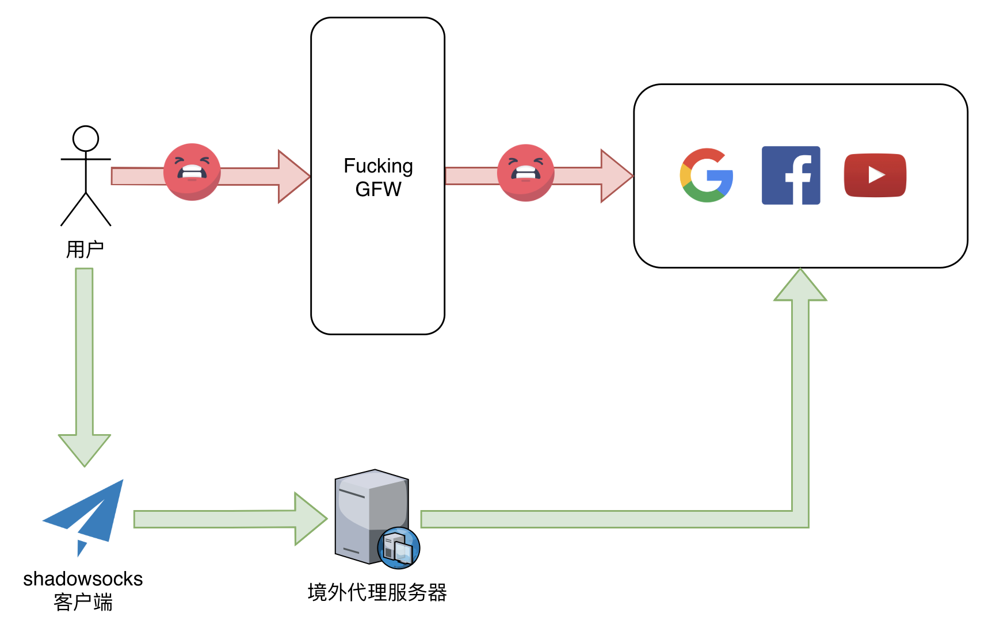

# 手把手教你，搭建搬瓦工 VPS

由于经常需要翻山越岭看看墙外的世界，用过很多浏览器插件、第三方代理，考虑到服务的稳定性和安全性，于是决定开始搭建一个属于自己的代理。

## 前言

### VPS

### VPN

### SS

### GFW

### 正向代理与反向代理

## 翻墙原理

## 软硬件环境

一台搬瓦工服务器，或者一台国外的服务器。这里以搬瓦工为例

- 搬瓦工服务器配置
  - 系统：CentOS 7 x86_64 bbr

## 搬瓦工

- 搬瓦工用户登录
  - https://bwh8.net/clientarea.php
- 搬瓦工免费更换IP的方法
  - https://www.banwago.com/2058.html
- 登录搬瓦工KiwiVM后台管理面板，在新窗口打开以下链接进行IP检测：
  - https://kiwivm.64clouds.com/main-exec.php?mode=blacklistcheck

- 如果满足70天免费更换的条件，则会出现免费更换IP的按钮，点击即可

## Quick Start

